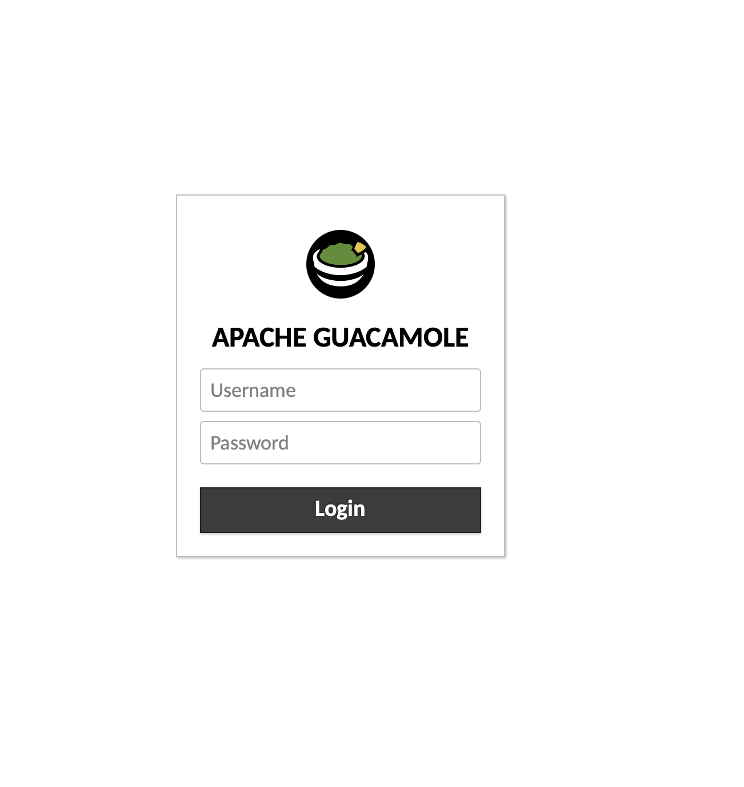
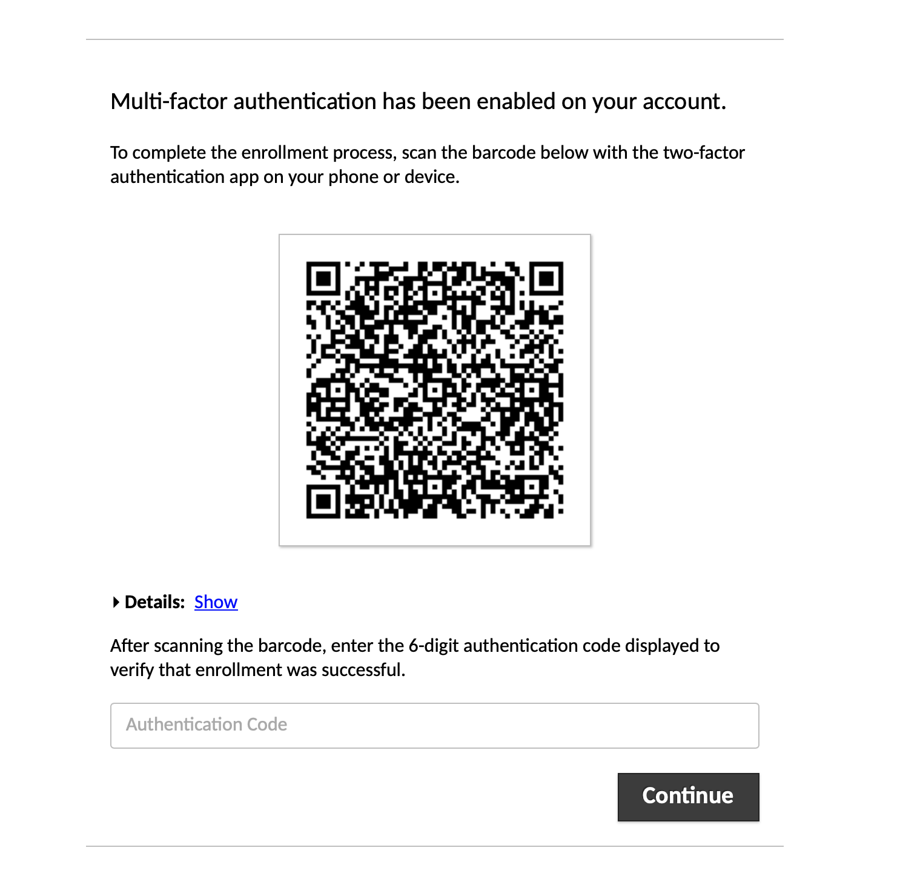
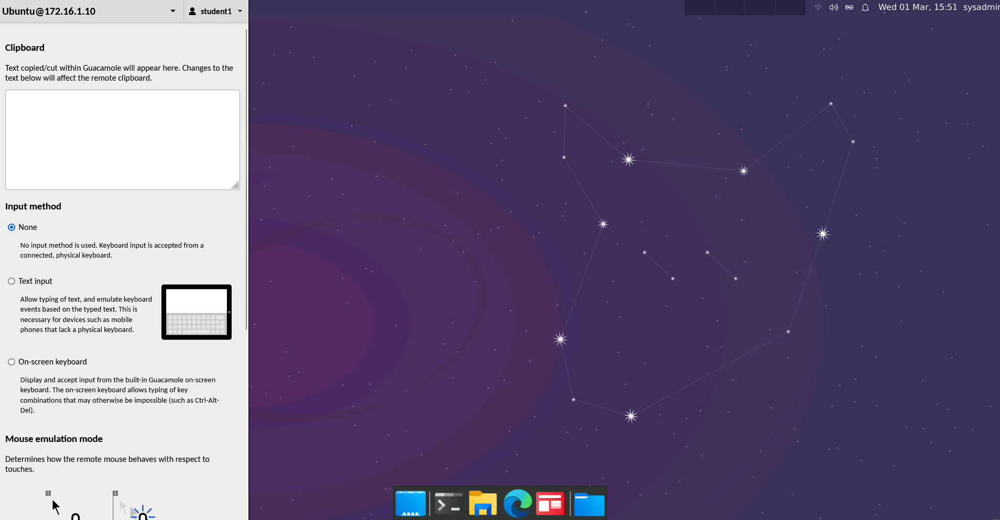

## Web Labs Student Guide

### 01. Signing into to Web Labs

In order to connect to the web lab, your instructor will Slack the classroom specific web lab URL. Be sure to bookmark this URL as you will use it throughout the entire course.

- Once you browse to the classroom's web lab URL, you will be prompted for credentials. Your instructor will also Slack you your initial credentials. Your username should start with 'Student' followed by a number. The default password is **password**. 
	
	
	
- Once you login, you will be asked to change your password.

	

- You will then be asked to set up multi-factor authentication.

	
	
	### Important Notes on Multi-factor Authentication ###

- Not all Authenticators will work with Guacamole!

	- The following authenticators **do not** work at this time:

		- Authy
		- Microsoft Authenticator
		- Google Authenticator (on Apple iOS devices)

	- The following authenticators have been tested and currently work:

		- Last Pass Authenticator: [Google Play Store](https://play.google.com/store/apps/details?id=com.lastpass.authenticator&hl=en_US&gl=US&pli=1), [Apple App Store](https://apps.apple.com/us/app/lastpass-authenticator/id1079110004)
		- Google Authenticator: (Android Only - Does not work on iOS devices) [Google Play Store](https://play.google.com/store/apps/details?id=com.google.android.apps.authenticator2)
		- Authenticator Chrome Extension: [Authenticator.cc](https://authenticator.cc/)

	---

	:warning: Disclaimer: Our recommendations for third-party authentication apps are provided as suggestions only, and we assume no liability for any breaches of security, data leaks, or unauthorized access that may occur. It is your responsibility to evaluate and select the authentication app that best suits you, and we encourage you to stay informed about security best practices. By using our recommendations, you acknowledge and accept these terms.
		
	---

### 02. Accessing Web Labs

- After logging in, ensure you can access the Ubuntu VM by double-clicking on it.

	

- You should see the default Ubuntu desktop. If prompted for credentials for 'sysadmin', the password is **cybersecurity**.

	
	
### 03. Web Lab Usage

Web labs use a service called **Guacamole** to render the virtual machine in your browser. 

- In order to copy/paste from Guacamole, press ctrl+shift+alt (Windows) or ctrl+command+shift (Mac)
	
	
	
- There shouldn't be a reason to tamper with any settings within Guacamole unless instructed to do so. 

- If the VMs within Guacamole become corrupted or have a major issue, your instructor has the ability to reset the VM.

---

© 2023 edX Boot Camps LLC. Confidential and Proprietary. All Rights Reserved.    
